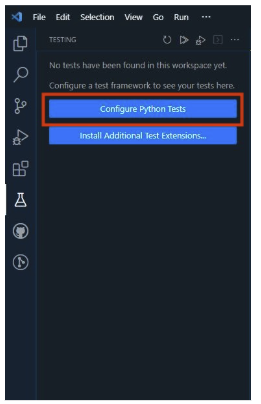
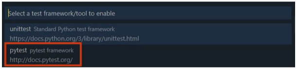
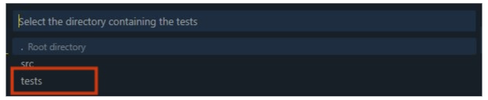
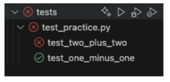
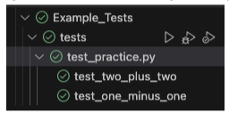
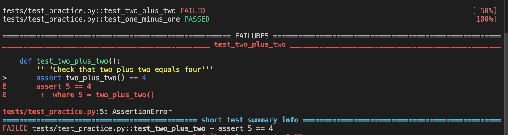
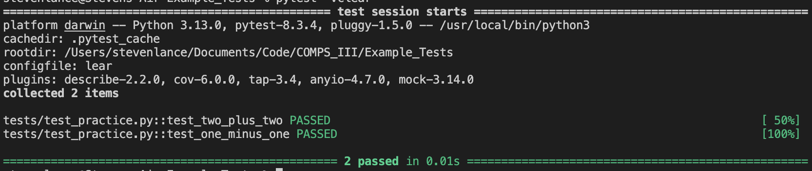

# How to Run Tests to Grade Code - Example Test
There are two ways you can run the unit tests in order to grade your code:
- **Option #1**: [Running Unit Tests in VS Code with Testing](#option-1-running-unit-tests-in-vs-code)
- **Option #2**: Running Unit Tests in Your Terminal

## Option #1: Running Unit Tests in VS Code
To run the tests directly in VS Code do the following: 
1. Press Code and copy the HTTPS URL that is provided.
2. In your terminal, type the following replacing PASTE_URL_HERE with the URL you copied.
```bash
git clone PASTE_URL_HERE
```
3. This will clone the code down to your machine. You can navigate into the folder by typing:
```bash
cd FOLDER_NAME
```
**NOTE**: You can get the folder name by typing the command `ls`.

4. Open the `practice file` in VS Code.
```bash
code practice.py
```
**NOTE**: The code command opens the file directly in VS Code. You can set this up using the documentation ([Windows](https://code.visualstudio.com/docs/editor/command-line) and [Mac](https://code.visualstudio.com/docs/setup/mac#_launching-from-the-command-line)).

5. Click the flask icon in the left tool bar.


6. Next, click "Configure Python Tests".



7. You'll have two options to select. Select pytest.



8. Select the folder that contains the tests. In this case you should select tests. You can always change this in the `settings.json` file that will be created in a `.vscode` folder for you.



9. You can now run the tests by pressing the play icon. Press the play icon to see if the tests pass. Oh no! `two_plus_two` seems to fail.



10. In `practice.py`, find the `two_plus_two` function. You’ll notice it is not returning the correct value. Update the function so that it returns the value.
11. Run the tests again and you should see that they are all passing!



## Option #2: Running Unit Tests in Your Terminal
Unit tests can be run directly in the terminal. This can be done using the following steps.
1. Repeat steps 1 to 4 from the previous section.
2. Once the code file is open, navigate to the terminal and ensure you are in the correct folder.
3. Run the following command in your terminal
```bash
pytest --v
```
4. This will output a response that looks like the image below.



5. The image above shows that the function two_plus_two is failing because it is returning 5, but the test is expecting 4.
6. In `practice.py`, find the two_plus_two function. You’ll notice it is not returning the correct value. Update the function so that it returns the value.
7. Run the command in step 3 to run tests again and you should see that they are all passing!

